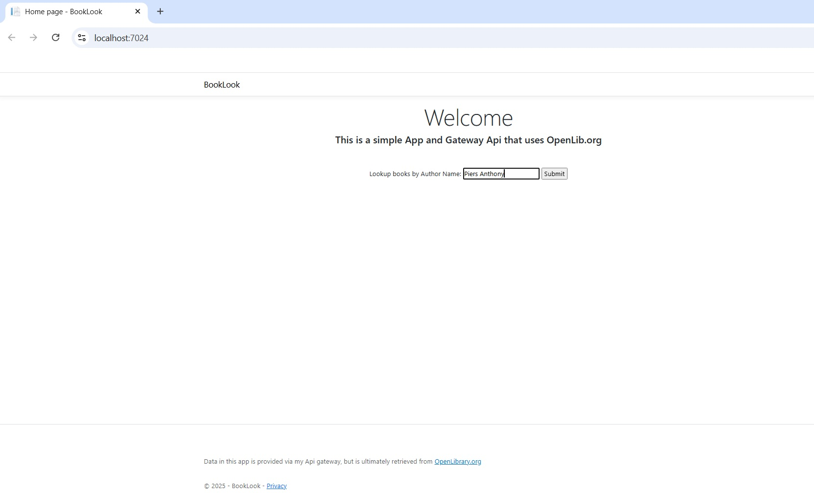
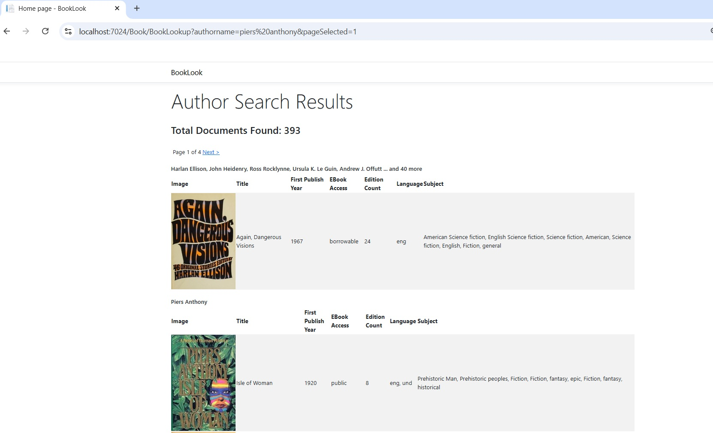
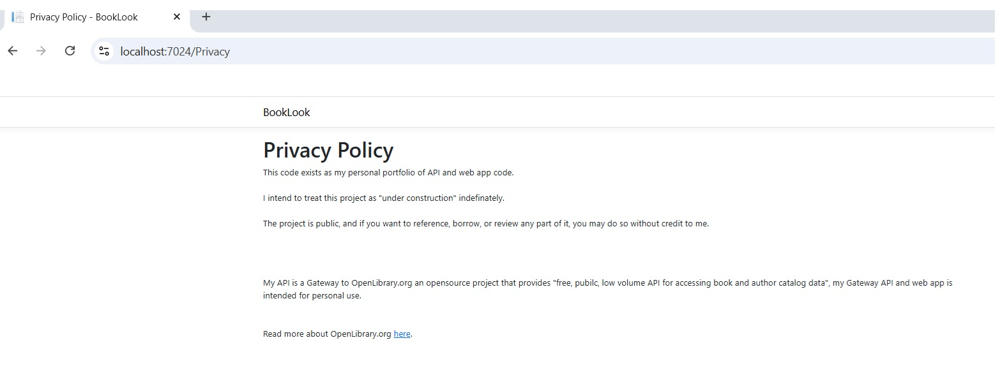
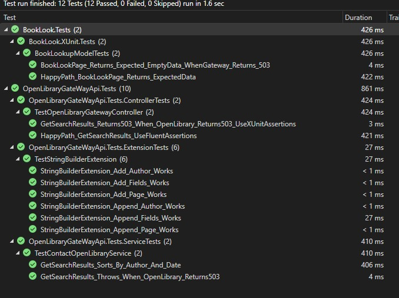

# Find Me 
At [LinkedIn](https://www.linkedin.com/in/camilleroy/)

# Purpose
This repository contains code, as a personal portfolio  to present some of my skills in C# API and web app development.

Note that I am a data-centric software engineer (i.e. I excel at SQL development / performance tuning / data modelling / data analysis) - but those skills are not currently on display in this app.

# Description

The primary purpose is to feature an API.  This is just a "gateway" API.  The Razor Pages allow user interaction and presentation of search results that it receives from the Gateway API.  

The gateway API calls an external free Web API ([OpenLibrary](https://openlibrary.org/)) to pull book data.

The web app project was developed using Razor Pages. 

# Developer Notes
The Web App allows a user to search for an author name, and contacts the Gateway API which in turn contacts OpenLibrary.org to get book search results as JSON, and deserialize that into objects and return that to the Razor Page for display.

### Things that I included:
* Tests 
* Extension methods 
* EntityFramework expressions/functions (Included a sorting expression/anonymous function)
* App Configs
* Dependency Injection

### Things that I haven't included:
* Authentication/Authorization
* Database Repository 

# What does it look like? 
## Web App Preview
Search Page

Search Results

Footer

Privacy

## Test Results

